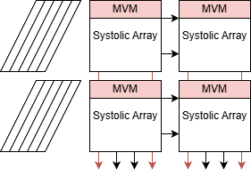
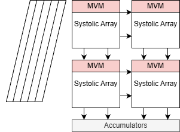
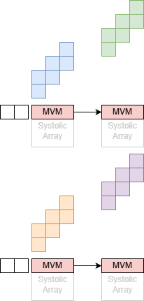

# QSA
Fused systolic array design consisted of configurable sub-arrays 

# Parallel Sub-Array Mode

This mode executes matrix-matrix multiplication exploiting the propagation of input in two weight stationary systolic array grids. This results in increased utilization when input data dimensions are smaller than physical dimensions of the grid.

# Fused Quad-Array Mode

This mode fuses the 4 nxn sub-arrays to a 2nx2n weight stationary systolic array.

# Matrix-Vector Multiplication Mode

This mode uses the first row configurable PEs to execute output stationary matrix-vector multiplication.
